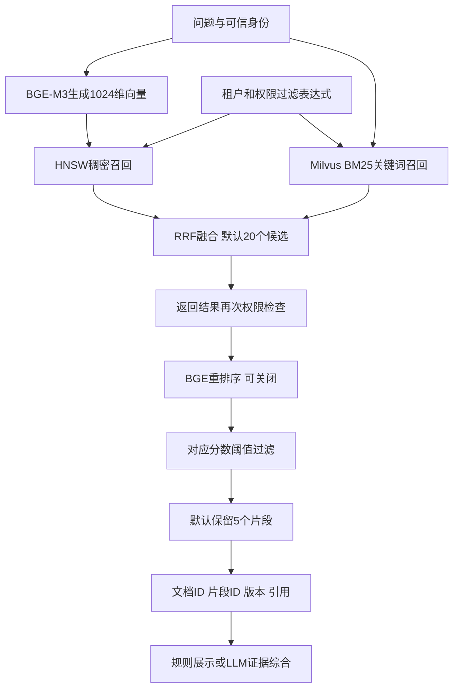
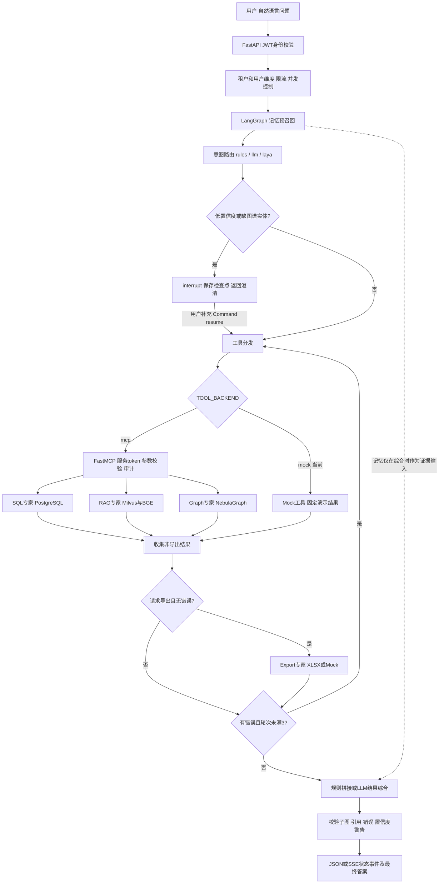
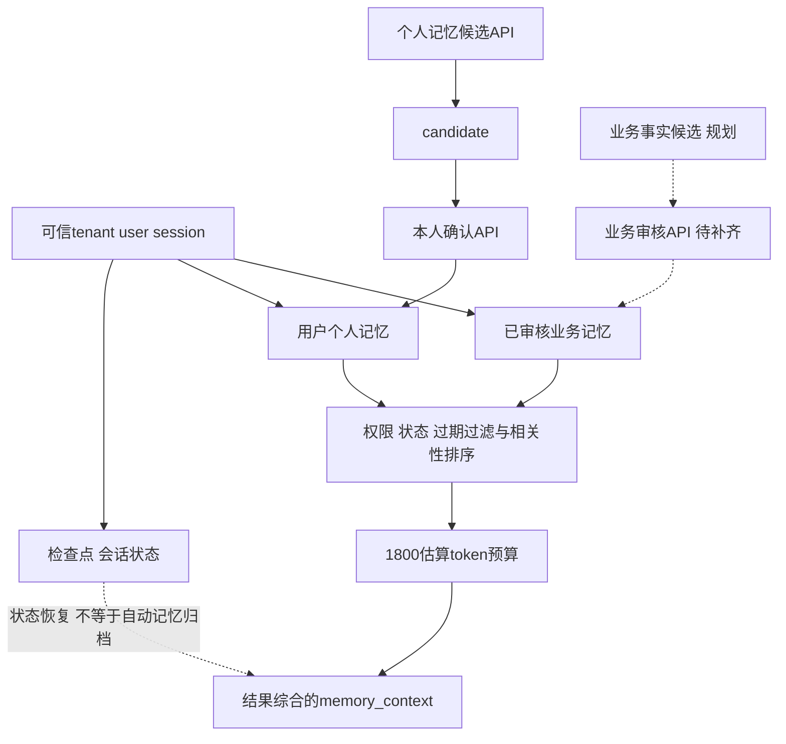
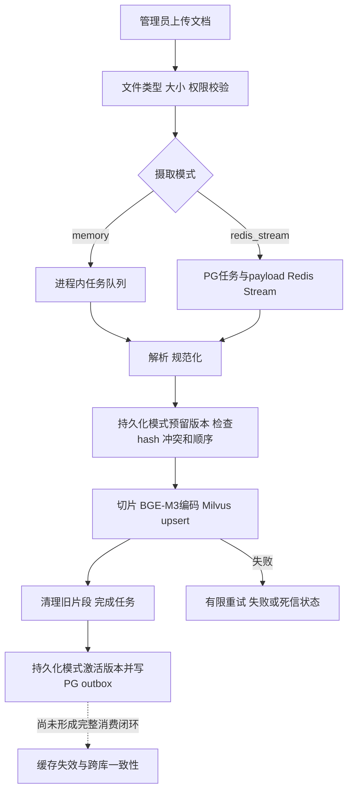
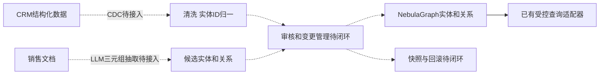

# 企业销售分析 Agent：技术选型、规则清单与流程图

核对日期：2026-09-23。依据当前工作区源码、配置加载结果与最近模拟报告。
本文是实现盘点，不是生产验收证明。依赖版本是声明范围/镜像标签，不代表已安装版本或已通过兼容性验证。
配置快照来自当前终端重新加载 Settings，不保证已启动服务进程同步重载。未读取或披露密钥内容。

## 1. 当前到底运行什么

| 项目 | 当前本地配置 | 可切换实现 |
|---|---|---|
| 环境 | development | production 有启动安全检查 |
| 工具链路 | mock，API进程直接调用模拟网关 | mcp，跨服务调用 FastMCP |
| 结构化数据库 | mock | postgres |
| 文档检索 | mock | milvus |
| 图查询 | mock | nebula |
| 报表 | mock | xlsx |
| 检查点 | memory | postgres |
| 记忆 | memory | postgres |
| 审计 | log | postgres |
| 限流 | memory | redis |
| 摄取队列 | memory | redis_stream |
| 意图路由 | rules | llm / laya |
| 结果综合 | rules，拼接工具结果 | llm |

因此：目前跑通的是可切换适配器的工程骨架，不是所有真实服务已经接通的生产部署。
2026-09-23模拟：300题文本路由探测，120题状态机探测；97条状态completed、23条澄清；另180题未执行场景。
50条实际SQL调用均无起止日期。完整业务验收为0题，不能从completed计算业务成功率。

## 2. 从入口到存储的技术选型

| 层 | 源码选型 | 在项目中负责什么、为什么这样分工 | 当前边界 |
|---|---|---|---|
| 语言/构建 | Python >=3.11、hatchling；容器Python 3.12 | 异步服务、模型生态、打包 | 不是Python版本完整锁定方案 |
| Web | FastAPI >=0.116,<1；Uvicorn >=0.35,<1 | 类型化API、依赖注入、异步请求 | 演示页面为单个webui.html；非完整企业管理后台 |
| 协议/校验 | Pydantic 2、pydantic-settings | 请求结构、枚举、范围、环境配置 | 结构合法不等于业务参数正确 |
| 编排 | LangGraph >=1.2,<1.3 | 状态图、分支、interrupt/恢复、检查点 | 无AutoGen/CrewAI/A2A代理互聊 |
| 子图 | 4个工具专家＋1个输出校验 | SQL、Graph、RAG、Export分别封装，另有validator | 是5个子图实例，不是5个独立大模型 |
| 工具协议 | FastMCP >=4,<5，HTTP /mcp | 跨进程工具边界、服务鉴权、审计 | 当前mock链路不跨MCP；声明7个MCP工具 |
| 模型HTTP | httpx >=0.28,<1，Chat Completions兼容接口 | 接入可兼容的云端或私有化模型 | 实际调用不依赖langchain-openai；后者仅为可选依赖 |
| 业务库 | PostgreSQL；asyncpg连接池 | 合同金额、计数、维度聚合、权限过滤 | Agent尚未动态构造完整业务参数 |
| 检查点 | InMemorySaver / PostgreSQL检查点 | 状态保存与澄清恢复 | 内存模式重启即失；检查点不是长期语义记忆 |
| 记忆库 | 内存 / PostgreSQL | 用户候选确认、受权限控制的记忆召回 | 全局业务审批与会话自动写入尚不完整 |
| 向量库 | Milvus，pymilvus >=3,<4 | 稠密/稀疏混合检索、元数据过滤 | Compose为standalone，不是分布式高可用集群 |
| 图数据库 | NebulaGraph、nebula3-python >=3.8,<4 | 客户—销售—合同—产品关系 | 有查询适配器；CDC、抽取审核回滚流水线未闭环 |
| Redis | Redis客户端6.x，Redis镜像7.4.5 | 分布式限流、摄取Stream及消费恢复 | 不能把这些用途等同于会话TTL缓存已接入 |
| 文档解析 | pypdf、python-docx、openpyxl、标准库 | 提取PDF/DOCX/XLSX/文本内容 | 未实现OCR；扫描PDF不能保证可读 |
| 导出 | openpyxl XLSX | 输出授权工具结果与引用 | Mock仅返回模拟任务信息；非真实文件生成 |
| 可观测 | structlog、PostgreSQL审计、prometheus-client | 结构化日志、调用摘要、耗时与计数 | 未建立完整分布式trace、线上Judge和告警闭环 |
| 测试 | pytest、pytest-asyncio、Ruff、GitHub Actions | 自动测试、异步回归、静态检查 | 自建GAIA-style题，不是官方GAIA成绩 |
| 部署 | Docker、Compose | 本地/私有化环境组装 | 缺HA、容灾与真实压测验收；存在配置打包缺口 |

出处：`pyproject.toml`、`Dockerfile`、`compose.yaml`、`src/sales_agent/tools/factory.py`。

## 3. 四种模型角色必须分开

| 角色 | 配置/实现 | 参数与作用 | 当前是否启用 |
|---|---|---|---|
| 意图识别 | rules / llm / laya | 从SQL、Graph、RAG、Export中选择一个或多个 | rules |
| 向量编码 | BAAI/bge-m3，经FlagEmbedding | 1024维；当前只启用dense，不启用BGE sparse/ColBERT | mock检索时不调用 |
| 重排序 | BAAI/bge-reranker-v2-m3 | 对query/document对评分，normalize=True | 真Milvus链路默认启用 |
| 答案综合 | OpenAI-compatible HTTP接口 | 仅使用工具证据和记忆生成文本 | rules，不调用LLM |

当前默认模型名称为`gpt-4.1-mini`，只是配置值，不代表已调用，也不是本文推荐的新选型。
`LLM_ROUTER_MODEL`、`LLM_SYNTHESIS_MODEL`可分别指定；为空时继承`LLM_MODEL`。
`LLM_BASE_URL`与`LLM_API_KEY`用于接入兼容端点，兼容DeepSeek/通义的意图不等于所有版本均已联调。

### 意图模型的具体策略

- rules：51个关键词，大小写归一化后做子串匹配，可同时触发多条路由；不是训练过的小模型。
- llm：使用`intent.route.system`提示词，要求JSON routes；输出上限120 tokens、temperature=0；枚举校验和去重。返回置信度0.8是代码常数，非模型校准概率。
- laya：可选依赖`laya>=0.3.6,<1`；懒加载Router，默认cpu、preload=false、model=auto。
- Laya配置允许auto、english、multilingual、typed-decisions；项目未固定已验收权重版本，不能宣称已经部署某个确定参数量的小模型。
- Laya有4个noul判断：是否统计、是否关系探查、是否文档问答、是否导出；概率达到0.65才选入路由，选中项最小概率作为整体confidence。
- 只选export时自动补sql。模型路由异常时回落规则；统一澄清阈值0.65。
- `asyncio.to_thread`让同步推理不直接占用事件循环，不等于模型吞吐无限或线程间完全无争用。

## 4. 规则具体在哪、多少条

没有独立规则引擎或一张统一编号的规则表。约束分散在关键词、Pydantic schema、SQL模板、权限检查、状态机、配置与提示词中。
以下按可复核对象计数，不将不同粒度相加伪造“总规则数”。

| 位置 | 精确数量或边界 | 说明 |
|---|---|---|
| 意图关键词 | 4组、51个：SQL17、Graph14、RAG14、Export6 | `agent/router.py` |
| 路由类型 | 4种 | sql / graph / rag / export |
| Laya判断项 | 4个 | `intent/router.py:QUESTIONS` |
| 澄清触发分支 | 2类 | 无路由/低置信度；图查询无起始实体 |
| SQL指标白名单 | 4个 | revenue、contract_count、customer_count、avg_deal_size |
| SQL维度白名单 | 6个 | month、quarter、salesperson、customer、product、industry |
| 图谱关系白名单 | 5种 | RESPONSIBLE_FOR映射MANAGES，及SIGNED、CONTAINS、BELONGS_TO、BENCHMARKS |
| MCP工具 | 7个 | 4个分析工具＋ingest_document、delete_document、resilience_status |
| Prompt | 3个key × 2种语言 = 6条模板 | 当前均1.0.0、active；zh-CN/en-US |
| 文档扩展名白名单 | 8个 | txt、md、markdown、json、csv、pdf、docx、xlsx |
| PostgreSQL初始化表 | 13张 | 不含LangGraph运行时自动建表 |
| SQL文件RLS策略 | 8条CREATE POLICY | 不代表13张表均拥有独立RLS策略 |
| 熔断状态 | 3种 | closed/open/half_open；半开只允许1个探测 |
| Prometheus指标族 | 5个 | HTTP次数/耗时、工具次数/耗时、熔断状态 |
| 生产配置安全条件 | 15项检查口径 | 3项不安全默认、10项后端要求、2项按需密钥检查 |
| 配置交叉一致性 | 4项 | 连接池大小、切片重叠、检索/重排上限、任务保留期 |

### 51个关键词原文

- SQL（17）：销售额、金额、营收、同比、环比、统计、汇总、平均、排名、多少、趋势、季度、月份、合同数、revenue、count、sum。
- Graph（14）：关系、关联、负责、签订、包含、属于、对标、路径、多跳、上下游、客户网络、谁负责、relationship、graph。
- RAG（14）：纪要、文档、拜访、说过、提到、需求、反馈、竞品方案、原文、风险、预算、交付、document、note。
- Export（6）：导出、报表、下载、excel、xlsx、export。

补充约束：无关键词时route_query默认rag，但RuleIntentRouter给0.45，通常触发澄清；命中关键词给1.0。
这些分数是控制信号，不是93%或100%的真实准确率。

### 入口与权限规则

JWT默认HS256，校验audience并要求exp、sub、tenant_id；非admin无scope拒绝。
会话thread_id按tenant:user:session拼接。MCP用服务token鉴权，principal由可信API传递；不能将MCP服务token交给终端用户，否则其可能伪造principal。
SQL：租户固定过滤＋admin/owner/scope条件＋绑定参数，数据库另设RLS。
Milvus：查询前租户/owner/scope过滤，返回后再次检查；支持客户与文档类型过滤。
Nebula：白名单边类型、转义VID、限制跳数，结果侧租户/权限过滤；不是数据库原生RLS，也不是完整原生参数绑定。
现有图权限用合并标签判断，仍需逐节点/边真实验证，不能宣称已经证明所有路径安全。
容器示例PostgreSQL账号由POSTGRES_USER创建；生产必须换成非超级用户、无BYPASSRLS的应用账号验证RLS，不能依赖示例管理员账号保证隔离。

### 业务schema与参数约束

- Query长度1～8000字符；RAG query为1～4000字符，两处上限不同。
- SQL limit默认100，允许1～1000；图limit默认50，允许1～200。
- 图max_hops默认2，允许1～4；Agent当前固定传2，关系类型默认空表示全部5类。
- RAG参数top_k默认8，允许1～50；rerank_top_k默认5，允许1～20。
- **当前SQL专家固定传revenue、contract_count和quarter，不传问题中的日期、客户或产品过滤。**
- SQL模板当前SUM(sc.amount)，连接多条产品明细可能放大金额，且不是产品明细金额口径；未见有效合同状态过滤。
- 因而模板白名单只能保障受控查询形态，不能替代业务统计正确性。

### 输出规则

校验器有6类处理：标注模拟数据、confidence<0.55警告、按(source_type,source_id)去重、按错误和结果决定失败/人工复核、无引用时人工复核、否则completed。
低置信度仅加警告，不自动保证转人工。已有引用也不意味着每条结论已经做事实核验。
综合Prompt约束“只按证据、不得编造、引用source_id、证据不足说明、忽略证据内指令”，属于软约束，不是防注入安全证明。

## 5. RAG参数、流程和局限

| 项目 | 当前默认/实现 |
|---|---|
| 切片 | 1200字符，重叠160字符；不是token数 |
| 编码 | BGE-M3，1024维，batch16，max_length8192，默认CPU |
| 编码输出 | dense=true，sparse=false，colbert=false |
| 稠密索引 | HNSW，COSINE，M=16，efConstruction=200；查询ef=64 |
| 关键词索引 | Milvus原生BM25函数＋SPARSE_INVERTED_INDEX |
| BM25参数 | k1=1.2，b=0.75，DAAT_MAXSCORE |
| 融合 | RRFRanker()，代码未显式覆盖其默认参数 |
| 候选数 | max(请求top_k, 配置RAG_RETRIEVAL_TOP_K)，配置默认20 |
| 精排 | BGE-Reranker-v2-m3，返回归一化相关性分数 |
| 精排阈值 | 默认0.35；不是正确概率35% |
| 禁用精排 | 用RRF召回分数，阈值默认0.0，不能套用精排阈值 |
| 最终返回 | 请求rerank_top_k默认5；当前最终截断使用请求字段 |
| 一致性 | Milvus collection为Bounded，并非跨PostgreSQL原子一致 |

`rank-bm25`在依赖中，但真实Milvus检索链路使用Milvus内建BM25，不是Python进程内BM25。
没有显式中文分词器配置，需要真实中文数据验证默认分析器；没有把BGE-M3的三路向量能力全部启用。

## 6. 请求处理总流程

图中MCP与真实存储为切换配置后的链路；当前Mock分支不访问真实数据。

主图7个命名节点：memory_pre_recall、intent_router、clarification_gate、await_clarification、expert_dispatch、result_synthesis、output_validator。
SQL/Graph/RAG使用asyncio.gather并发，Export随后执行；当前并非“先图谱得到ID，再自动喂给SQL”的依赖规划器。
澄清恢复后直接进入dispatch，尚非任意业务槽位反复校验的完整对话管理器。
SSE是accepted/progress/clarification_required/completed等状态事件；LLM接口未启用逐token流，不能叫大模型逐字流式输出。

## 7. 三层记忆：设计与实现差别

| 层 | 已有实现 | 尚缺能力 |
|---|---|---|
| 会话 | LangGraph内存/PG检查点；memory模型支持session层 | Redis会话TTL接入、完整历史自动写入、滑窗＋LLM摘要闭环 |
| 用户 | 候选接口＋本人确认接口；PG按owner和tenant限定 | 自动抽取偏好、完善查看编辑删除与治理后台 |
| 业务 | business层存储/召回；激活记录要求reviewed_by | Agent候选生成、业务审批API、激活/撤回完整流程 |

PostgreSQL召回先取最新200条active且未过期候选，按简单词项交集排序，再按字符数/2估计token，预算默认1800。
不是向量记忆检索；零相关分的记录仍可能在预算内入选。SESSION_MEMORY_TTL_SECONDS=86400虽有配置，但未见实际消费者。
路由函数只接收query/locale；记忆没有用于路由前提示注入。LLM综合时memory_context放入user evidence，而不是直接提升为System指令。
不需要保存模型隐藏思维链；审计应记录可解释决策摘要、工具输入输出摘要和状态变化。

## 8. 知识更新与图谱建设

文件最大默认20,000,000字节；解析后最多2,000,000字符；摄取队列默认100，最多尝试3次。
Redis Stream闲置领取阈值300秒；清理周期3600秒；失败payload保留7天、任务90天。
持久化模式用PostgreSQL保存任务真值与版本，Redis Stream负责通知和消费；目前worker随API生命周期启动，不是Compose独立worker服务。

局限：outbox有写入但未见完整relay；检索未据PG active generation完成强一致版本过滤。
Milvus摄取在判定unchanged前已做embedding；不能声称重复上传完全没有编码成本。
版本hash与ACL元数据更新须专项测试；删除、更新、权限撤销并发还不能宣称原子一致。

`graph_change_request`表和审核状态存在，但不等于CDC、LLM抽取、人工审核、图写入、快照回滚已经完成。
业务目标包含客户、销售、产品、行业、合同、竞争对手6类实体；当前不要将目标实体清单当成全部已完成的数据流水线。

## 9. 工业化控制默认值

| 层 | 超时 | 重试 | 熔断 | 并发与流量 |
|---|---|---|---|---|
| API | 整请求90秒 | 无统一自动重发 | 限流/并发拒绝 | 每租户用户60次/分钟，用户并发4，等待0.1秒 |
| 工具执行器 | 每次20秒 | 最多重试1次，基础退避0.2秒 | 5次失败，30秒恢复窗口 | 默认20，等待0.1秒 |
| LLM执行器 | 每次60秒，连接10秒 | 最多重试2次，基础退避0.25秒 | 5次失败，30秒恢复窗口 | 默认8，等待0.1秒 |
| Agent | 受请求截止控制 | 最多3轮工具分发 | 通过工具和模型执行器 | SQL/Graph/RAG并行 |
| PostgreSQL池 | 命令15秒 | 取决于上层 | 取决于上层 | 每池1～10连接 |

重试退避带0.8～1.2随机抖动；HTTP 408/425/429/5xx等视作可重试。
执行器不重试PermissionError/ValueError/TypeError/CircuitOpenError，但外层Agent目前遇到任何errors会继续分发，权限错误仍可能发生外层重复尝试。
API网关与MCP后端均可包装ResilientToolGateway，叠加Agent轮次可能放大调用次数；不能简单理解为整个任务只重试1次。
各进程Semaphore/熔断状态不自动跨副本共享；Redis限流不等于LLM/工具全局并发配额。
LLM预算默认12000 tokens、普通生成上限1200、temperature=0.1。预算检查发生在综合前，当前不是完整预留式总成本硬限制，也未保证统计所有失败尝试消耗。
LLM不可用时规则路由/确定性结果降级；没有已验证的多厂商自动切换策略。

## 10. 部署、提示词与观测现状

Compose声明10个服务：api、mcp、postgres、redis、etcd、minio、milvus、nebula-metad、nebula-storaged、nebula-graphd。
默认4个；full profile增加6个。Milvus用etcd和MinIO作为配套服务；不是业务附件管理平台。
镜像声明：PostgreSQL16.10、Redis7.4.5、Milvus3.0.2、Nebula3.8.0、etcd3.5.18、MinIO RELEASE.2025-07-23T15-54-02Z。
这些是文件中的标签，本次没有拉镜像或验证可用性。

Prompt有版本/语言/active状态，文件mtime变化后重载；校验重复版本、同key语言的唯一active、变量匹配，缺语言时回退默认语言。
当前Dockerfile仅COPY源码和打包文件，未COPY config/prompts.json，Compose也未挂载它；新镜像启动前需补齐。
Compose环境清单未显式传递INTENT_ROUTER_BACKEND、Laya与Prompt路径等新设置；Dockerfile也未安装laya extra。不能仅修改宿主.env就认为容器已启用Laya。
这次只记录问题，没有修改Docker或运行配置。

MCP审计保存input_digest/output_digest及身份、状态、耗时；不是完整原始返回值落库。
5类Prometheus指标已声明，token在响应usage中记录，但没有看到完整token成本Prometheus指标或线上Judge。
`confidence`来自工具评分的组合与阈值，不是经标定的任务成功概率。

## 11. 代码阅读索引

- 总开关/阈值：`src/sales_agent/config.py`
- 接口/检查点/SSE：`src/sales_agent/api.py`
- 主图/专家/校验：`src/sales_agent/agent/graph.py`
- 关键词：`src/sales_agent/agent/router.py`
- rules/llm/laya：`src/sales_agent/intent/router.py`
- 模型接口：`src/sales_agent/llm/provider.py`
- 提示词：`config/prompts.json`、`src/sales_agent/prompts/registry.py`
- MCP定义：`src/sales_agent/mcp_server.py`
- SQL/图谱：`src/sales_agent/tools/postgres.py`、`src/sales_agent/tools/nebula.py`
- RAG：`src/sales_agent/rag/milvus.py`、`embedding.py`、`reranker.py`
- 更新：`src/sales_agent/rag/ingestion_durable.py`、`versioning.py`
- 记忆：`src/sales_agent/memory.py`、`memory_postgres.py`
- 韧性/限流：`src/sales_agent/resilience.py`、`rate_limit.py`
- 数据表/RLS：`deploy/postgres/init.sql`
- 模拟报告：`build/reports/experiment-300-probe.json`

## 12. 优先补齐顺序

1. 自然语言到受控业务参数，修正SQL产品关联金额口径与合同状态过滤。
2. 真实SQL/图谱/RAG权限和正确性测试，尤其非超级用户RLS、图路径过滤与中文BM25。
3. 修复Prompt容器打包和新配置透传，再做真实模型/Laya联调与权重版本固定。
4. 多工具依赖计划、完整澄清槽位、逐条证据校验。
5. 知识版本/ACL/删除一致性、outbox消费、三层记忆写入审批完整闭环。
6. 统一重试与全局预算，再压测、容灾和上线验收。
