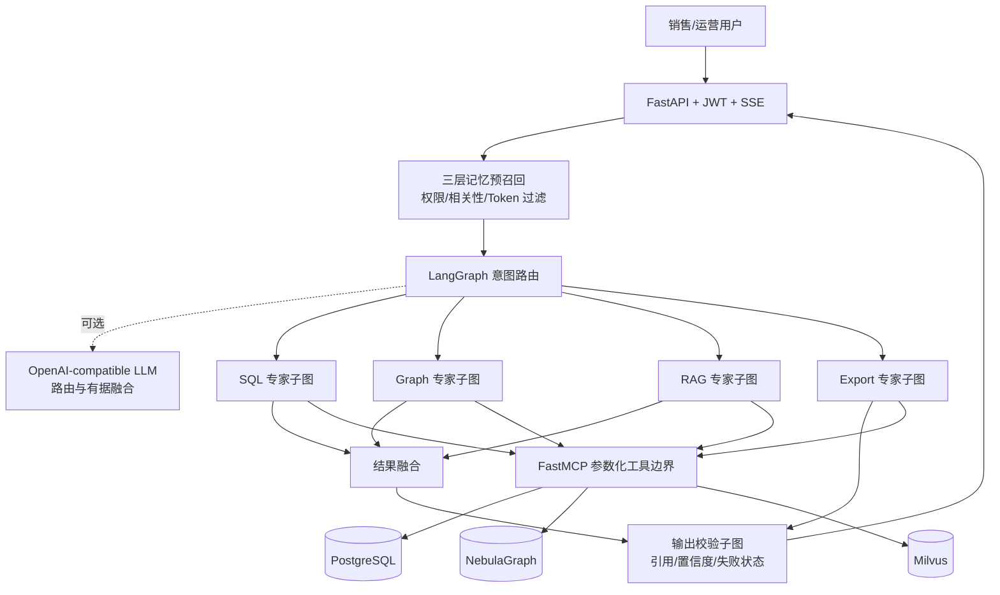

# 架构说明

## 在线请求链路



主图不会让专家相互自由对话。一个问题可以命中多个 route，调度节点并行运行对应子图；导出依赖前序结果，因此在第二波执行。

## 关键不变量

1. 身份上下文不可由 LLM 构造。API 从已验证 JWT 生成 `Principal`，MCP 和数据层重复校验。
2. Agent 不接受也不生成可执行查询。SQL/nGQL 模板只存在于 MCP 服务的数据适配器中。
3. 聚合走 PostgreSQL，关系遍历走 NebulaGraph，文本证据走 Milvus/BM25/reranker。
4. 每一条业务结论必须能映射到 SQL 查询快照、图谱版本/路径或文档 chunk。
5. 用户记忆写入需要用户确认；business memory 只能由审核流程激活。
6. 图谱文档抽取只生成 `graph_change_request`，审核后才写入当前有效图谱。
7. HTTP 和 MCP 审计只保存输入/输出 SHA-256 指纹及必要元数据，不默认落原始敏感载荷。

## 生产替换点

| 当前适配器 | 生产适配器 | 约束 |
|---|---|---|
| `MockToolGateway` | `MCPToolGateway` | MCP 必须服务间鉴权和超时/熔断 |
| MCP 内部 Mock backend | PostgreSQL/Nebula/Milvus adapters | 参数化模板、RLS/标签过滤、查询上限 |
| `InMemoryMemoryService` | `PostgresMemoryService`（已实现）+ Redis session cache | TTL、用户隔离、审核状态、审计 |
| `InMemorySaver` | `AsyncPostgresSaver`（已接入） | 首次 setup、连接池、严格反序列化白名单 |
| 规则路由 | 规则高精度 + 结构化 LLM fallback | route schema 固定，低置信转人工 |
| 确定性融合 | Grounded LLM synthesizer | 只使用工具 payload，逐结论引用 |

## LLM 接口边界

- `rules` 是默认模式，无密钥也能运行和回归测试。
- `llm` 模式使用 OpenAI-compatible Chat Completions Provider，路由输出必须解析为固定 route 枚举。
- 合成 Prompt 只注入经过权限过滤的 memory 和 MCP 工具结果，并要求按 `source_id` 标注依据。
- 模型超时、协议错误、非法 JSON 或预算耗尽都会降级到确定性输出。
- API Key 使用 Pydantic `SecretStr`，管理 API 只返回 `api_key_configured`。
- Router 与 synthesis 可配置不同模型，便于分别优化成本和答案质量。

## 数据权限

API、MCP、数据库三层都要执行权限。请求进入 PostgreSQL 事务后应设置：

```sql
SET LOCAL app.tenant_id = 'tenant-a';
SET LOCAL app.user_id = 'sales-001';
SET LOCAL app.scope_tags = 'sales:sales-001,region:east';
SET LOCAL app.is_admin = 'false';
SET LOCAL app.session_id = 'session-001';
```

初始化脚本给出了 RLS 示例。生产中还需防止连接池复用导致上下文残留，必须使用 `SET LOCAL` 并限定在事务内。
